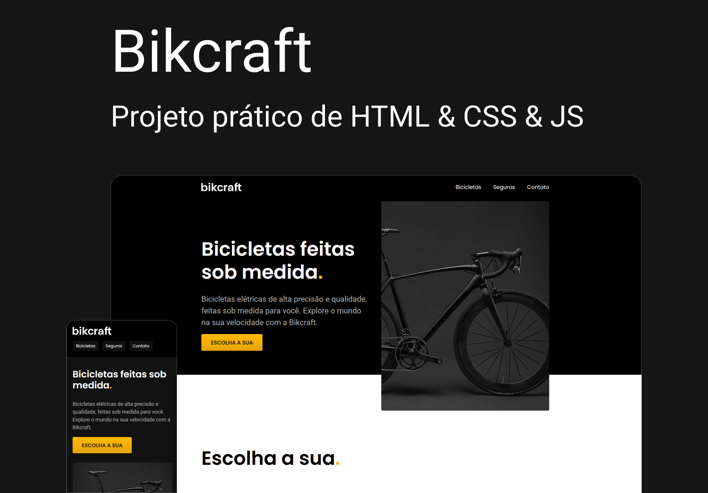

# Origamid - Bikcraft



<div>
  
  
  
<div>
<br /> <br />

# HTML5 & CSS3 & JS: +20hrs

  <p>
    Aprenda a desenvolver interfaces de alta qualidade através de uma metodologia simples e com exemplos práticos. <br />
    Ideal pra quem deseja conquistar uma nova habilidade. <br />
    Domine as principais técnicas para se tornar um front-end capaz de codificar qualquer tipo de layout. <br />
    <b>HTML5, CSS3 e JS</b>.
  </p>

## PROJETOS

## Bikecraft

  <p>
    Projeto que une teoria + prática aprendendo cada decisao de código, sem lib / frameworks. Utilizando CSS flexbox e grid layout, projeto totalmente responsivo e performático.<br />
  </p>
  <br /> <br />

# 📚 Aprendizados

Criar animações suaves e intercaladas com cards (Motion Design). <br />
Organizar as informações e elementos visuais de forma simples, intuitiva e agradável, baseando em estudos, mantendo a consistência de estilos.
<br /><br />

# 🚀 Deploy

[Ver online](https://diogorealles.github.io/)

## Clone

```
git clone git@github.com:DiogoRealles/git
```

<p>Gostou? deixa seu like!</p>
<p>Estou disponível para realizar seus projetos</p>

<!--
<a href="mailto:diogorealles@hotmail.com"></a>
-->

<a href="https://www.linkedin.com/in/diogorealles/"></a>

<p><strong>

[Diogo Realles](https://diogorealles.github.io/) | 2025
</strong></p>
