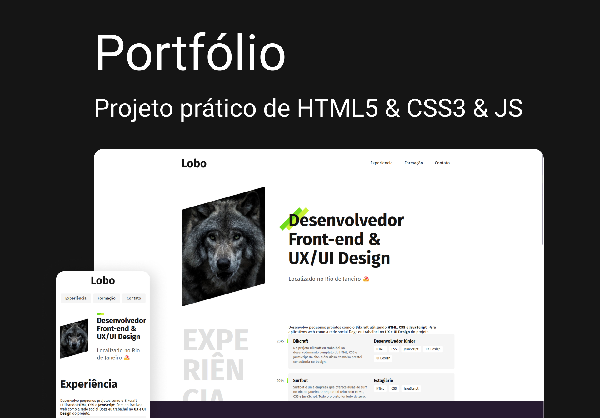

# Portfólio



<div>
  
  
  
  
<div>
<br><br>

# ⚡ Overview

<b>Portfólio:</b> Objetivo do projeto foi criar um portfólio responsivo, desenvolvida com as technologias:<br />
<b>HTML5</b> | <b>CSS3</b> | <b>JavaScript</b> | <b>SASS</b> e métodologia <b>BEM</b>.
<br /><br />

## Features:

- AOS JS
- Fully responsive
- SEO optimized
- W3C validation
- Pages load speed
- Page Home
- Page About
- Page Post details
- Smooth animation on scroll
- Images new gen
  <br /><br />

# 📚 Aprendizados

Criar animações suaves e intercaladas com cards (Motion Design). <br />
Organizar as informações e elementos visuais de forma simples, intuitiva e agradável, baseando em estudos, mantendo a consistência de estilos.
<br /><br />

# 🚀 Deploy

<a href="https://diogorealles.github.io/projects/desafio01/" target="_blank"></a>
<br /><br />

## Clone

```
git clone git@github.com:DiogoRealles/git
```

<p>Gostou? deixa seu like!</p>
<p>Estou disponível para realizar seus projetos</p>

<!--
<a href="mailto:diogorealles@hotmail.com"></a>
-->

<a href="https://www.linkedin.com/in/diogorealles/"></a>

<p><strong>
  
  [Diogo Realles](https://diogorealles.github.io/) | 2025
  </strong></p>
