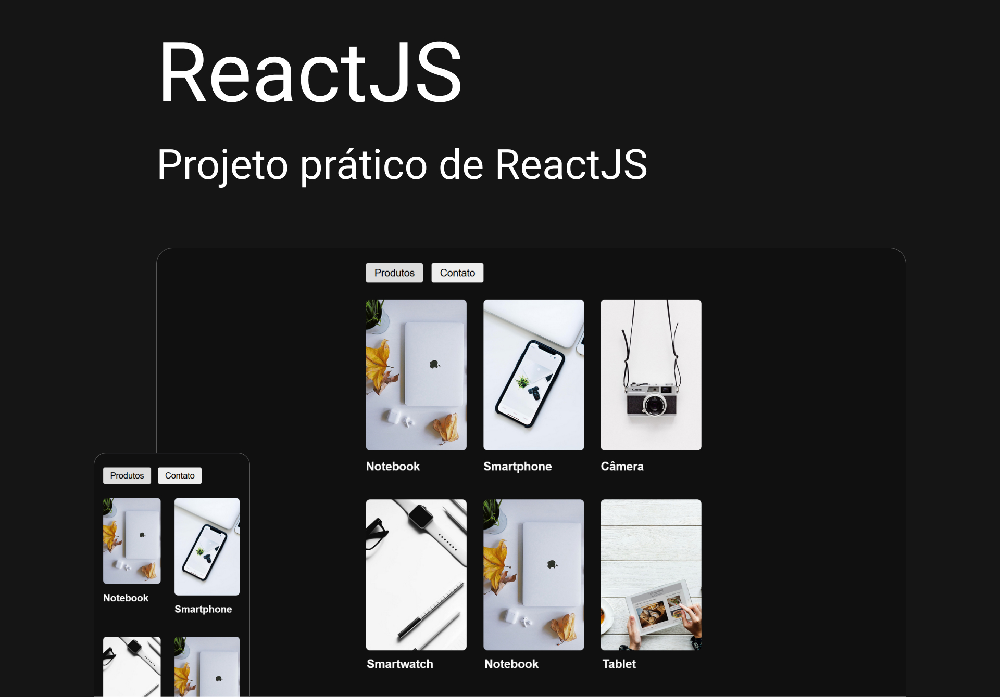

# Origamid - ReactJS

  
  
  
  

   

# React: +18hrs

  React do zero para o desenvolvimento de aplicações web reativas.  
  Foco é no entendimento completo do React, com isso praticamente tudo será criado do zero, sem a dependência de pacotes externos.  

- **Fundamentos do React + Vite:** . 
- **Vite, Components, props, children, hooks:** . 
- **CSS / styled-components:** . 
- **React Router DOM:** . 
- **Consumindo API:** . 
- **Intro a estrutura de pastas:** . 
- **React Router DOM:** . 

   
